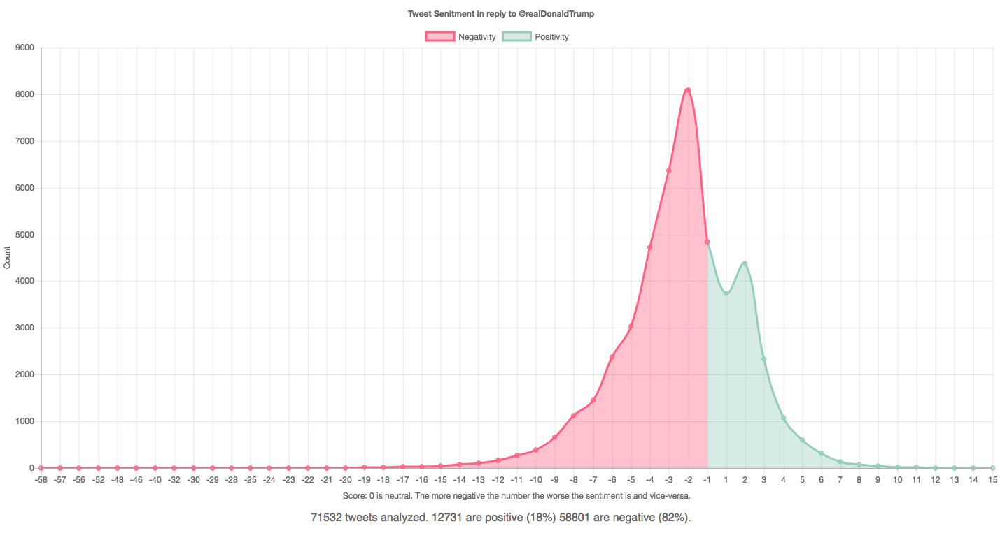

### Tweet Sentiment Analysis of replies to Donald Trump

#### Why?
I wanted to learn how `reactive` programming in javascript worked using [RxJS](https://github.com/reactivex/rxjs). At the same time I was also curious what the sentiment was towards the current 45th President Donald Trump on Twitter.

#### What?
This code runs locally using [NodeJS](https://nodejs.org/) along side a [MongoDB](https://www.mongodb.com/) database.

I am using the [twitter-stream-api](https://dev.twitter.com/streaming/overview) and filtering by tweets mentioning `@realDonaldTrump` and in_reply_to `realDonaldTrump`.

The code then runs the `tweet.text` through a [Sentiment](https://github.com/thisandagain/sentiment) analysis which scores it with a positive or negative whole number.

A simple [Express](https://expressjs.com) server is also running, which serves data to an HTML page which renders the data using [Chartjs](http://www.chartjs.org/) every 10 seconds.

### Setup
1. Hook up a MongoDB server.
2. Install Node.
3. Rename `.env_sample` to `.env` and add your [Twitter API Credentials](https://apps.twitter.com/) to it.
3. `npm install`
4. `npm start`
5. Open `http://localhost:3000` in your browser.

#### Disclaimer
This is purely a research and educational project. I am not a Data Analyst. With any sentiment analysis there is significant room for error. I am not seeking to push a specific political agenda publicizing this data and code. This code is not `production` ready in its current state to be deployed publicly.
